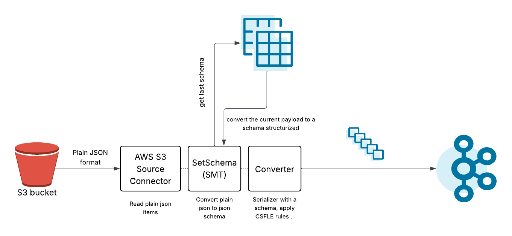
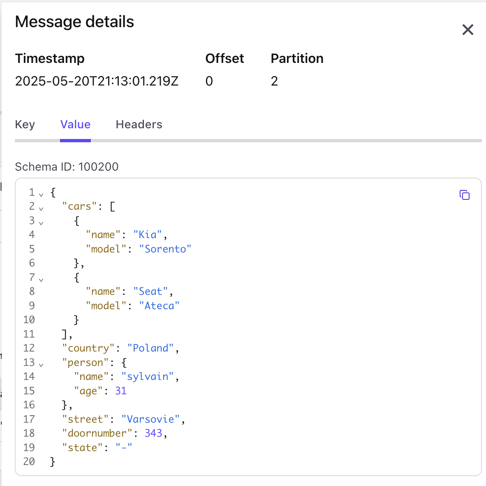
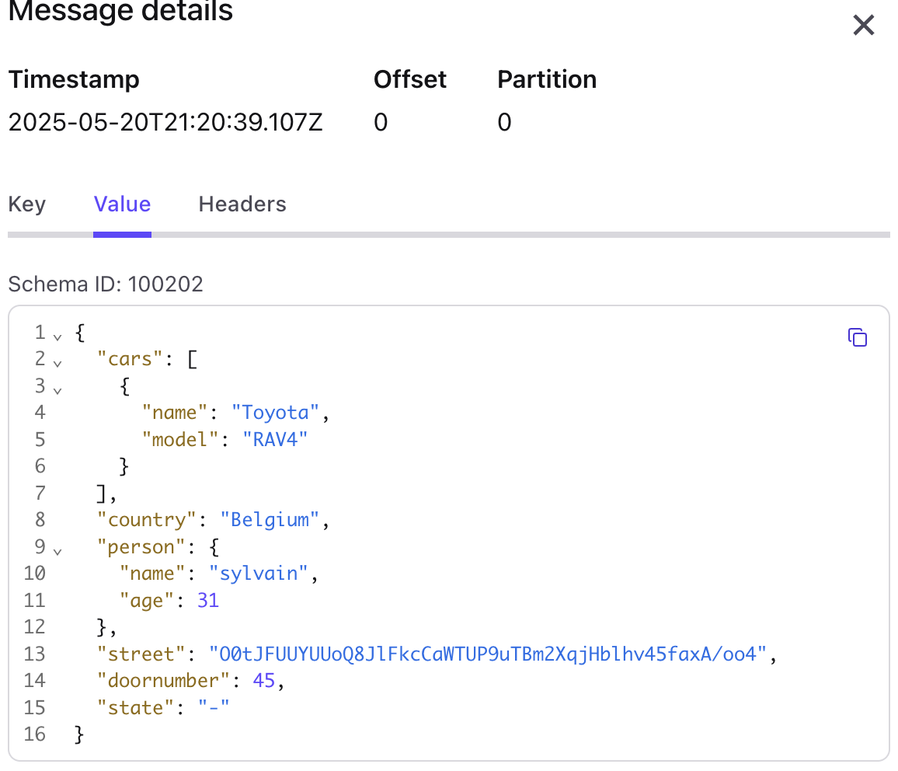

# Use case

This SMT was developed with the goal of streaming plain JSON data from an AWS S3 bucket to a Kafka topic with a schema.

Currently, the S3 Source connector is not able to infer the JSON payload to determine a schema, meaning that the message in Kafka is not enforced with a schema.
If we want to use the CSFLE mechanism and encrypt certain fields before Kafka, this is not possible with the JSON format in the S3 connector.

This SMT will fetch the schema already present in the schema registry and perform a mapping to be able to use a schema converter (JSON, PROTOBUF, or AVRO) afterwards.



# Build the SMT

``` bash
cd ./smt
mvn package
```

Jar is located at `smt/target/kafka-connect-transform-schema-1.0-SNAPSHOT*.jar`

# Example

## Build your local connect image with the SMT previously package

``` bash
docker-compose build
```

## Start a local connect cluster 

Update the configuration with your own Confluent Cloud Kafka Cluster + Confluent Cloud  Schema Registry in the `.env` file and then starting the docker stack :

``` bash
docker-compose --env-file .env up
```

## Register a schema in your schema registry

``` bash
source .env
curl -X POST -H "Content-Type: application/vnd.schemaregistry.v1+json" \
    -u $CC_SCHEMA_REGISTRY_API_KEY:$CC_SCHEMA_REGISTRY_API_SECRET \
    $CC_SCHEMA_REGISTRY_URL/subjects/person-value/versions \
    --data '@example/schema.json'
```

## Start a new S3 Connector with the SMT

> Create a topic "person" in your cluster

> Update some property in the `example/connector.json`, especially : 
- AWS Region
- AWS Access Key Id and Secret
- AWS Bucket Name
- Bucket Directory Name
- Confluent Cloud Schema Registry API Key and Secret in the SMT

> Deploy your connector via :

``` bash
curl -X PUT http://localhost:8083/connectors/s3-source/config \
    -H "Content-Type: application/json" \
    -d @example/connector.json
```

## Offload files in your bucket

Upload a json file in your favorite bucket : 

Example : 
```json
{
    "country": "Poland",
    "state": "-",
    "street": "Varsovie",
    "doornumber": 343,
    "person": {
        "name": "sylvain",
        "age": 31
    },
    "cars": [
        {
            "name": "Kia",
            "model": "Sorento"
        },
        {
            "name": "Seat",
            "model": "Ateca"
        }
    ]
}
```

## Let's see what happen in your Kafka Topic

Visualize your message in your Kafka Topic enforced by the schema :


### Quick example with a CSFLE rule

Update your schema to apply encryption based on PII tags :


`street` is now encrypted with [CSFLE](https://docs.confluent.io/cloud/current/security/encrypt/csfle/overview.html)

